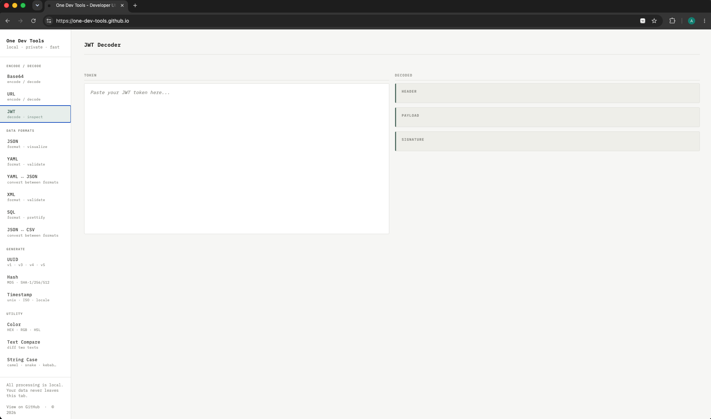

# One Dev Tools

A collection of essential developer utilities that run entirely in your browser. No server, no tracking, no build step — open `index.html` and go.



---

## Tools

Tools are grouped into five categories in the sidebar.

### Personal

| Tool | What it does |
|------|-------------|
| **To-Do** | Task list with localStorage persistence. Multi-line items (Shift+Enter), inline edit on double-click or F2, keyboard navigation, and alternating row colours. Completed items shown with a warm background instead of strikethrough — readable as notes. |
| **Pomodoro** | Focus timer with 25/5 (Classic) and 50/10 (Extended) modes. Progress ring, session dots, Start/Pause/Reset/Skip controls, and a two-tone Web Audio chime on session completion. |

### Encode / Decode

| Tool | What it does |
|------|-------------|
| **Base64** | Encode text to Base64 or decode Base64 back to text. Handles UTF-8. |
| **URL** | Encode text to URL-safe format or decode URL-encoded strings. |
| **JWT** | Decode JWT tokens — header, payload, and signature. Known claims show tooltips; timestamp fields render as human-readable dates. Expiry indicator: red if expired, amber if expiring within 5 minutes. |

### Data Formats

| Tool | What it does |
|------|-------------|
| **JSON** | Format (prettify) or minify JSON with adjustable indent size. Includes an interactive tree visualiser with collapsible nodes and inline value editing. |
| **JSON ↔ CSV** | Convert a JSON array of objects to CSV, or a CSV file (with header row) to a JSON array. Auto-detects numeric values on CSV → JSON. |
| **YAML ↔ JSON** | Convert YAML to JSON or JSON to YAML, with adjustable indent. |
| **YAML** | Format and validate YAML with adjustable indent size. |
| **YAML ↔ Properties** | Convert Spring Boot `application.yaml` to `application.properties` and back. Handles nested keys, arrays (indexed notation), and boolean/number coercion. |
| **XML** | Format (prettify) or minify XML with correct per-line indentation for text nodes. Validates structure on format. |
| **SQL** | Format or minify SQL with keyword uppercasing and clause-per-line layout. Validates: unterminated strings, unbalanced parentheses, unclosed comments, invalid statement openers, SELECT without FROM, and missing commas in SELECT and ORDER BY lists. |

### Generate

| Tool | What it does |
|------|-------------|
| **UUID** | Generate UUIDs in v1 (time-based), v4 (random), v3 (name-based MD5), or v5 (name-based SHA-1). Outputs standard hyphenated and compact 32-char formats. Generate one or ten at a time. |
| **Hash** | Generate MD5, SHA-1, SHA-256, and SHA-512 hashes from any input text. |
| **Timestamp** | Live current time in Unix seconds, Unix milliseconds, ISO 8601, and browser locale. Convert any Unix timestamp to multiple formats with relative time. Convert a date/time picker value to Unix timestamps. |
| **Cron** | Build cron expressions with five individual fields, or paste an expression to parse it. Plain-English description, next 5 run times, and 10 one-click presets. |

### Utility

| Tool | What it does |
|------|-------------|
| **Color** | Convert between HEX, RGB, and HSL. Visual color picker with live preview. Enter any format and get all three. |
| **Text Compare** | Line-by-line diff of two texts using LCS. Shows added/removed lines with gutter line numbers and ±N summary. Unchanged runs are collapsed with a separator. Identical texts render in full. |
| **String Case** | Converts text in any format (spaces, hyphens, underscores, camelCase) to all eight case styles simultaneously: camelCase, PascalCase, snake_case, kebab-case, CONSTANT_CASE, lowercase, UPPERCASE, Title Case. |
| **Regex** | Live regex tester — match list with index, length, and capture groups; full highlighted view of all matches in the test string. |
| **Markdown** | Live side-by-side Markdown preview. Supports headings, bold/italic/strikethrough, lists (including nested sub-bullets), tables, code blocks, blockquotes, links, and images. |
| **HTTP Status** | Collapsible reference for all standard HTTP status codes (1xx–5xx). Unofficial/vendor codes (nginx, Cloudflare, AWS ALB, Apache) are mixed into the appropriate groups with a vendor tag and distinct styling. Searchable by code, name, description, or vendor. |

---

## Running locally

```bash
git clone https://github.com/one-dev-tools/one-dev-tools.github.io.git
cd one-dev-tools.github.io
open index.html        # macOS
start index.html       # Windows
xdg-open index.html    # Linux
```

No build process, no dependencies to install.

## Deploying to GitHub Pages

1. Push to the `main` branch of a repository named `<username>.github.io`.
2. In repository **Settings → Pages**, set source to **main / (root)**.
3. The site will be live at `https://<username>.github.io` within a few minutes.

## Project structure

```
├── index.html        — markup and tool panels
├── styles.css        — layout, sidebar, typography, dark mode, component styles
├── app.js            — nav wiring and shared utilities
├── tools/
│   ├── encode.js     — Base64, URL, JWT
│   ├── formats.js    — JSON, XML, YAML, YAML↔JSON, JSON↔CSV, SQL, YAML↔Properties
│   ├── generate.js   — Hash, UUID, Timestamp, Color, Cron
│   └── utility.js    — Text Compare, String Case, Regex, Markdown, HTTP Status, Pomodoro, To-Do
├── tests/
│   ├── index.html    — browser test runner
│   └── *.test.js     — test suites (129 tests)
└── README.md
```

## Features

- **Dark mode** — follows system preference automatically; toggle button in the sidebar overrides and persists the choice
- **Local storage** — To-Do items and theme preference persist across sessions
- **No network requests** — all processing happens in the browser; only Google Fonts and two CDN libraries (js-yaml, CryptoJS) are loaded externally

## Dependencies

| Library | Used for |
|---------|----------|
| [js-yaml](https://github.com/nodeca/js-yaml) | YAML parsing and serialisation |
| [CryptoJS](https://github.com/brix/crypto-js) | MD5, SHA-1, SHA-256, SHA-512 hashing |

Everything else is vanilla HTML, CSS, and JavaScript.

## Browser support

Requires a modern browser with `crypto.subtle` and `crypto.randomUUID` support.

- Chrome / Edge 90+
- Firefox 88+
- Safari 14+

## License

MIT
